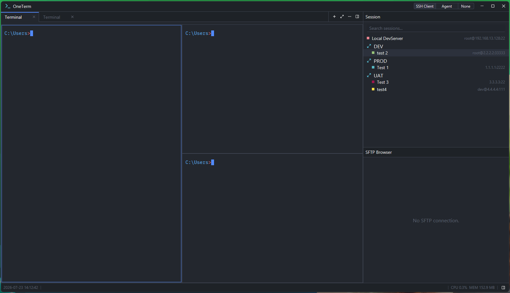
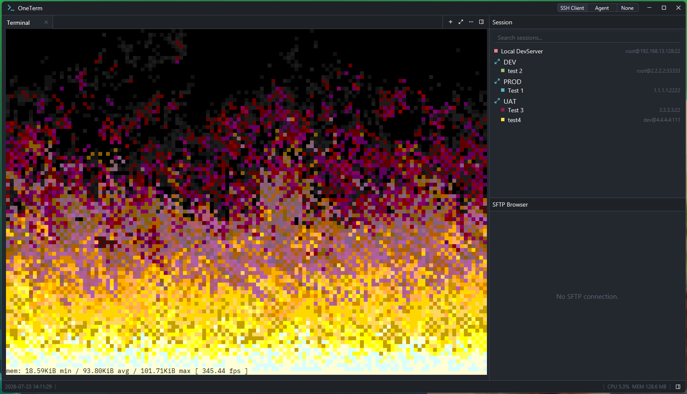
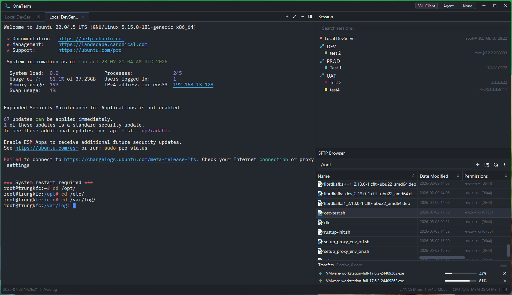
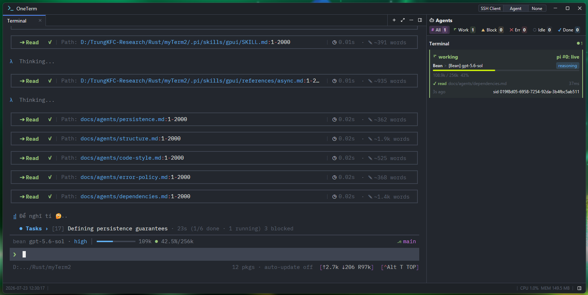
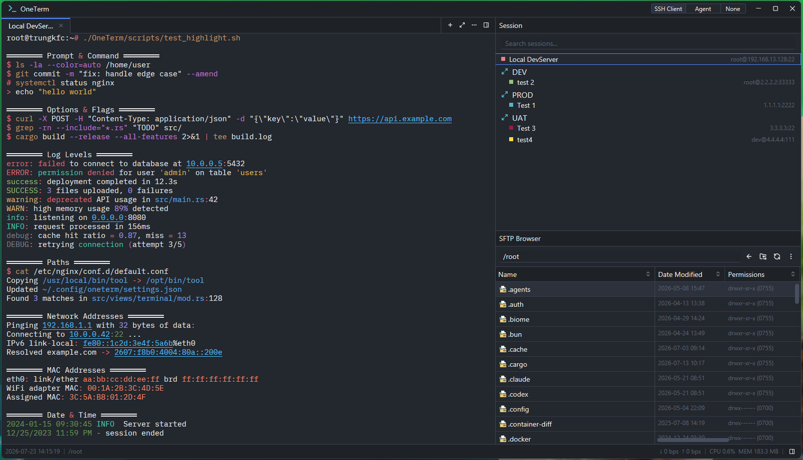
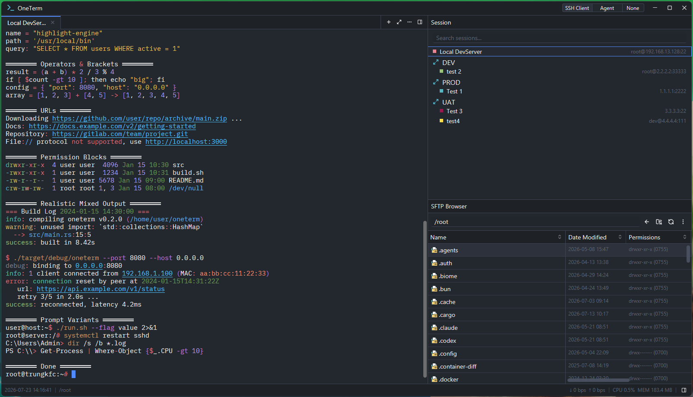

# OneTerm

OneTerm is a Terminal application for SSH/SFTP/Local Shell with a **Zed-style workspace UI**: 
- Connect to remote shells over SSH
- Browse and transfer files over SFTP
- Open local shells
- Monitor coding agents in a live Agent Panel fed by the OSC 20308 proposal ([spec](docs/osc-agent-status.md)). 
- Powered by `Rust`, `gpui`, `gpui-component` and OneTerm's own VT engine `oneterm-vt`

---

## ⭐ Showcase

| | |
|:---:|:---:|
|  |  |
| Multiple sessions across tabs with resizable split Spaces | Terminal emulator — 24-bit colors, box drawing, ANSI/VT |
|  |  |
| SSH connectivity + SFTP file browser with transfer queue | Agent Panel — right-dock fleet view (OSC 20308) |
|  |  |
| Semantic highlight via shell integration (OSC 7 / 133) | Semantic highlight detail — CWD, prompt, and output coloring |

---

## ✨ Features

### 🖥️ Terminal emulator

- ANSI / VT parsing and grid via `oneterm-vt`, OneTerm's own engine
- 24-bit colors, box drawing, and multiple cursor styles
- Fallback fonts for Nerd Font prompt icons (`font.fallbacks`, defaults to the Nerd Font symbol fonts) and font ligatures (`font.ligatures`, on by default)
- Mouse selection, middle-click paste (switchable in Settings), search, scrollback, and custom scrollbar
- URL / OSC 8 detection, IME support, clipboard via OSC 52, bell
- OSC 9 toasts, OSC 9;4 progress, and shell integration (OSC 7 / 133 / 0 / 2 / 4 / 104 / 10 / 11 / 12)
- Sixel graphics (`img2sixel`, `chafa -f sixel`, `lsix`, `timg`): images are drawn in the grid, scroll with the text, and DA1 advertises them

### ⌨️ Command auto-completion

- Cursor-anchored suggestion overlay for commands, subcommands, and options
- Three sources with `H`/`C`/`O` tag badges: in-session history, hand-authored
  catalogs (git, cargo, …), and generated catalogs (Windows commands, coreutils)
- Shell-aware: a `bash` prompt never suggests `cmd` commands and vice-versa
- Subcommand trees (`git remote add -…`) with per-node options + breadcrumb
- Frecency-ranked history that **never** stores or suggests secret values
  (passwords, tokens, API keys are redacted at capture)
- TUI-safe: suppressed on the alternate screen (vim/less) and outside the
  OSC 133 command-input region; append-only accept (`Tab`/`Enter`)
- Fully configurable in `terminal.json` / the Settings UI

### 🪟 Terminal split (Spaces)

- Resizable split Spaces (Right / Left / Up / Down) with nesting
- Drag a terminal tab into an empty Space to fill it
- Context-menu driven; closing to one Space restores a single terminal
- Broadcast input channels A..E: type once into every Space of a channel, across
  tabs; a coloured chip on the tab and a badge on each member Space show who is
  listening, and the selected member's highlight takes its channel colour

### 🔌 SSH connectivity

- SSH client based on `russh`
- Password, private-key, and no-auth authentication
- Auto-resize shell channel with optional shell integration
- Bandwidth indicator; passwords stay in RAM only

### 📁 SFTP file browser

- Browse remote directories with breadcrumbs and sortable columns
- Upload / download, rename / delete, create folders, view properties
- Expand the browser across the workspace (like zooming a terminal tab) into a dual-pane Local + Remote view: browse local folders, upload / download with a click, a double-click, or drag & drop between the panes
- Transfer queue with progress bars and cancellation
- Sync the browser to the active SSH session CWD via OSC 7

### 🗂️ Session management

- Grouped session tree with connect, rename, color, and search
- Persisted to `ssh_session.json` (passwords never stored)

### 🤖 Agent Panel

- Right-dock fleet view of coding agents
- Currently supports Pi Coding Agent (`pi install npm:@vnstrawhat/pi-oneterm`)
- Built from the OSC 20308 proposal and folded into a global Agent Registry
- Shows working, blocked, idle, done, and error

### 🧩 Layout & UI

- Zed-style workspace with a flexible DockArea, left / right / bottom docks, and center tabs
- Multiple concurrent sessions across tabs
- Title bar, menu bar, status bar (clock, cwd breadcrumb, git branch/dirty state of the local shell, network speed, CPU/memory), zoom, and quick close
- Remembers dock layout across sessions (`docks.json`)

### ⚙️ Settings & theming

- Settings window (General / Terminal / Appearance / About)
- UI font size, key bindings, terminal tuning, and themes
- Terminal configuration in `terminal.json`
- Colors read from the theme, never hardcoded in components

### 💻 Local shell

- Local PTY via `oneterm-pty` (OneTerm's own ConPTY / `openpty` transport)
- Windows ConPTY is bundled; Unix local PTY compiles but is untested
- Windows is the primary platform; Linux/macOS compile but are untested

### 🛡️ Run as administrator (Windows)

The "+" (New Terminal) menu has a `Run as administrator ›` submenu listing the three
Windows shells. Picking one asks for consent and then opens a **second OneTerm window** that
runs elevated — Windows will not let an elevated shell attach to a pseudo-console this
process owns, so it cannot be a tab in the window you are already in. The window you were
working in keeps its tabs, its connections and its transfers, unelevated; declining the
prompt does nothing at all.

The elevated window is deliberately a smaller application, and it says what it is:

- **It is marked**, from the process token and never from how it was started:
  `OneTerm (Administrator)` in the taskbar and in the title bar. The title text is the whole
  marker — no colour, because a theme can change any colour and the text cannot be themed
  away. A window elevated any other way — right-click ▸ Run as administrator, a policy — is
  marked and restricted in exactly the same way.
- **No console window comes with it.** A debug build of OneTerm keeps a console so
  developers can read the log; an elevated one gives that console up at start-up, because a
  window started through `runas` gets a console of its own that nobody asked for. A release
  build never had one.
- **It has**: local Windows shells, your theme, font and key bindings, and everything the
  terminal itself does.
- **It does not have**: SSH, SFTP, saved sessions, Quick Connect, the Agent panel, the right
  dock or its mode toggles, updates (those are done from the normal window), or its own
  "Run as administrator" entries.
- **It writes no settings.** `ui_config.json`, `terminal.json`, `ssh_session.json` and
  `update_config.json` are read and never written, so an elevated session cannot change
  what your ordinary window opens with — not even by leaving a corrupt file quarantined.
  Its crash reports go to `crashes/elevated/` and it shows no crash dialog.
- **Your saved layout never carries over.** `docks.json` is not read at all there, so an
  administrator window always opens on the default layout: one terminal tab, no right dock.
  That is deliberate and it is what keeps the SSH and SFTP panels out — restoring a saved
  layout would rebuild them by name, before anything had a chance to decline.
- **Duplicate tab and New Terminal Here open at your home directory**, not at the tab's
  current directory. An elevated window does not take a working directory from anything
  outside itself, because `cmd.exe` searches it before `PATH`.
- **Drag-and-drop from Explorer does not work into any elevated window.** Windows forbids a
  drop from a medium-integrity Explorer onto a high-integrity window. It is inherent to
  elevation and cannot be fixed; under the list above there is no SFTP panel there to drop
  onto anyway.
- **What it runs is not taken from your settings.** The shell is resolved to a fixed path
  under `%SystemRoot%` or `%ProgramFiles%`, never through `PATH`, `%COMSPEC%` or
  `terminal.json`. None of that file's shell settings reach it — not the program, not the
  arguments, not the environment, not the working directory — and a custom shell cannot be
  elevated at all. Terminal logging is off there too. See
  [`docs/terminal-backend.md`](docs/terminal-backend.md) §6.1.1.
- **Its keyboard shortcuts are smaller too.** The SSH and SFTP actions are not bound in an
  elevated window, so `Ctrl+Shift+N` opens nothing there: a missing menu row is not the same
  as a missing action, and both have to go.

### 🔄 Auto-update

- Checks GitHub Releases of this repository (release notes, asset selection per platform)
- Never runs from an elevated window (see above)
- SHA-256-verified download, staged install with rollback, restart from the About page
- Configurable in Settings (auto-check, proxy, certificate verification) — see
  [`docs/auto-update.md`](docs/auto-update.md)

### 🧯 Crash reporting

- Rust panics and native crashes are captured into `crashes/*.crash.txt` under the config
  directory (user paths redacted) and offered for review on the next start; an elevated
  window stores its own under `crashes/elevated/` and shows no dialog — see
  [`docs/crash-reporting.md`](docs/crash-reporting.md)

### 🪟 Platform support

- OneTerm is **developed and tested primarily on Windows** — that is the
first-class, fully-supported platform (local shells use Windows ConPTY,
the release build embeds an app icon + version info, and runtime assets
such as `conpty.dll` / `OpenConsole.exe` are bundled).

- Linux and macOS **compile** and the cross-platform code paths are in
place, but they are **not yet tested**. Expect rough edges on those
platforms (local PTY, packaging, theming) until they receive a proper
QA pass. PRs improving Linux/macOS support are welcome.


## 🚀 Build & run

Requires: Rust toolchain (edition 2024).

```bash
# Run the app (keeps the console for logs in debug builds)
cargo run -p oneterm-app
# Same, with OneTerm's hot-path crates optimized (full-screen TUIs stay smooth in a debug build)
cargo run -p oneterm-app --profile fast-dev

# Build the whole workspace
cargo build --workspace

# Format + lint (must be warning-free)
cargo fmt --all
cargo clippy --workspace --all-targets -- -D warnings

# Test
cargo test --workspace
```

### Debug logging and terminal diagnostics

OneTerm uses `env_logger` and reads standard `RUST_LOG` directives. The normal development
run enables application DEBUG logs without enabling the extra terminal timing
instrumentation.

PowerShell:

```powershell
# General application debug logs
$env:RUST_LOG = "info,gpui=info,oneterm=debug"
cargo run -p oneterm-app

# Add terminal renderer and PTY timing diagnostics
$env:RUST_LOG = "info,gpui=info,oneterm=debug"
cargo run -p oneterm-app --features terminal-diagnostics

# Remove the override when finished
Remove-Item Env:RUST_LOG
```

Command Prompt (`cmd.exe`):

```cmd
set "RUST_LOG=info,gpui=info,oneterm=debug"
cargo run -p oneterm-app --features terminal-diagnostics
```

Bash (Linux, macOS, or Git Bash):

```bash
RUST_LOG="info,gpui=info,oneterm=debug" \
  cargo run -p oneterm-app --features terminal-diagnostics
```

The `terminal-diagnostics` feature is intentionally opt-in. It enables `[TerminalElement]`
renderer latency reports and `[PTY pump]` lock timing reports. The renderer reports after
its first painted frame and then at most once every five seconds while frames are painted;
the PTY pump reports over two-second sampling windows. These records use DEBUG logging, so
`oneterm=debug` is sufficient. Standalone diagnostics (DOOM-fire workload, raw PTY
throughput probe) live in `crates/tools`:
`cargo run -p oneterm-tools --release --bin doom-fire`.

### Release build

```powershell
# Windows (embeds icon + version info, stages into dist/)
pwsh scripts/build-release.ps1
pwsh scripts/build-release.ps1 -Target aarch64-pc-windows-msvc
```

```bash
# Linux / macOS — untested; see Platform support note
./scripts/build-release.sh
TARGET=aarch64-unknown-linux-gnu ./scripts/build-release.sh
```

The same scripts run in the release workflow (`.github/workflows/release.yml`), so local
and published packages are identical. Output lands in `dist/oneterm-<version>-<triple>/`
plus `dist/oneterm-<version>-<triple>.{zip|tar.gz}` and a `.sha256` checksum (GitHub
releases also publish a combined `SHA256SUMS`):
- **Windows** — `oneterm.exe` plus the runtime assets (`conpty.dll` + `x64/OpenConsole.exe`
  — see [`THIRD-PARTY-NOTICES.md`](THIRD-PARTY-NOTICES.md)); the exe
  has the app icon + version info embedded (build.rs).
- **macOS** — `OneTerm.app` bundle (double-click to launch **without** an extra
  Terminal.app window). On macOS a raw GUI binary is treated as a CLI tool, so
  Finder opens Terminal.app to run it; packaging it inside a `.app` bundle with
  an `Info.plist` (`NSPrincipalClass=NSApplication`) makes LaunchServices launch
  it directly — the macOS analog of the Windows `windows_subsystem = "windows"`
  fix. The `.icns` icon is generated best-effort from the Windows `.ico`; the bundle
  is ad-hoc signed (not notarised).
- **Linux** — the `oneterm` binary. Configuration files are created in `~/.OneTerm/` on
  first run; nothing else is shipped.

---

## 📚 Documentation

- [`docs/README.md`](docs/README.md) — documentation index (current vs. archived)
- [`AGENTS.md`](AGENTS.md) — developer & AI-agent guide
- [`docs/architecture.md`](docs/architecture.md) — architecture index (crate map, service registration)
- [`docs/agents/structure.md`](docs/agents/structure.md) — project structure & dependency graph
- [`docs/agents/crate-dependency-rules.md`](docs/agents/crate-dependency-rules.md) — hard crate & dependency rules (R1–R12)
- [`docs/agents/code-style.md`](docs/agents/code-style.md) — code conventions
- [`docs/agents/dependencies.md`](docs/agents/dependencies.md) — dependencies & rev lock
- [`docs/terminal-backend.md`](docs/terminal-backend.md) — terminal backend design (local + ssh)
- [`docs/terminal-split.md`](docs/terminal-split.md) — terminal split (Spaces) design
- [`docs/ssh-client-connect.md`](docs/ssh-client-connect.md) — SSH connection / auth design
- [`docs/sftp-browser-design.md`](docs/sftp-browser-design.md) — SFTP file browser design
- [`docs/sftp-follow-terminal-cwd/README.md`](docs/sftp-follow-terminal-cwd/README.md) — SFTP-follows-terminal-CWD design
- [`docs/osc-agent-status.md`](docs/osc-agent-status.md) — OSC 20308 agent status proposal/spec
- [`docs/osc-sequences-checklist.md`](docs/osc-sequences-checklist.md) — OSC sequence support checklist
- [`docs/auto-update.md`](docs/auto-update.md) — auto-update design
- [`docs/crash-reporting.md`](docs/crash-reporting.md) — crash reporting and recovery
- [`docs/auto-completion.md`](docs/auto-completion.md) — command auto-completion design
- [`LICENSE`](LICENSE) (Apache-2.0) · [`NOTICE`](NOTICE) · [`THIRD-PARTY-NOTICES.md`](THIRD-PARTY-NOTICES.md)
